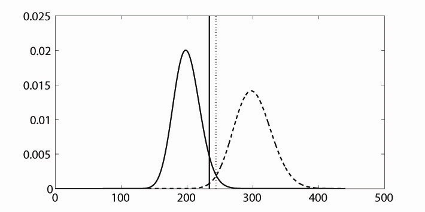

```{r setup, include = FALSE}
knitr::opts_chunk$set(
  collapse = TRUE,
  comment = "#>"
)
```

Power Analysis for Structural Equation Models

Contact: <morten.moshagen@uni-ulm.de>

&nbsp;

# Introduction

`semPower` provides a collection of functions to perform power analyses in structural equation modeling. The main functions of `semPower` are:

* [semPower.aPriori](#ap): determine required N, given alpha, beta or power, effect, and df
* [semPower.postHoc](#ph): determine achieved beta and power, given alpha, N, effect, and df
* [semPower.compromise](#cp): determine alpha and beta, given the alpha/beta ratio, N, effect, and df 

All functions require the specification of the discrepancy between H0 and H1, i.e. the magnitude of effect in a given metric. `semPower` understands the following effect-size measures: F0, RMSEA, Mc, GFI, AGFI (see below for details). Alternatively, it is also possible to define the effect by providing the H0 and the H1 covariance matrices (see [covariance matrix input](#cov))

In addition, `semPower` can be used to create power-plots:

* [sempower.powerPlot.byN](#plots): Plot achieved power as function of N for a given effect 
* [sempower.powerPlot.byEffect](#plots): Plot achieved power as function of the magnitude of effect for a given  N


&nbsp;


# Background

The statistical evaluation of mathematical models often proceeds by considering a test-statistic that expresses the discrepancy between the observed data and the data as implied by the fitted model. In SEM, the relevant test statistic for a sample of size N is given by $T = \hat{F}(N-1)$. $\hat{F}$ denotes the minimized sample value of the chosen discrepancy function (such as Maximum-Likelihood) and thereby indicates lack of fit of the model to the sample data. Thus,  $T$ permits a likelihood-ratio test of the null hypothesis (H0) that the model is correct. If the hypothesized model holds in the population, $T$ can be shown to follow asymptotically a central $\chi^2$(df) distribution with $df = .5 \cdot p(p+1) – q$ degrees of freedom, where p is the number of manifest variables and q denotes the number of free parameters. This is why $T$ is often referred to as “chi-square model test statistic” -- a convention which is followed here. 

Given an observed value for the chi-square test statistic, a null hypothesis significance test can be performed to evaluate whether this value is larger than would be expected by chance alone. The usual test proceeds as follows: Given a certain specified alpha-error level (typically alpha = .05), a critical chi-square value is obtained from the asymptotic central $\chi^2$(df) distribution. If the observed value for the chi-square test statisti exceeds the critical value, the null hypothesis that the model fits the data is rejected. Otherwise, H0 is retained. A finding of the observed statistic exceeding the critical value (implying an upper-tail probability  that falls below the specified alpha level) thus leads to the statistical decision that the discrepancy between the hypothesized and the actual population covariance matrix is too large to be attributable to sampling error only. Accordingly, a statistically significant chi-square test statistic provides evidence against the validity of the hypothesized model.

When testing statistical hypotheses using this framework, two types of decision errors can occur: The alpha error (or type-I error) of incorrectly rejecting a true H0 (a correct model) and the beta error (or type-II error) of incorrectly retaining a false H0  (an incorrect model). Statistical power is defined as the complement of the beta-error probability (1 - beta) and thus gives the probability to reject an incorrect model. If the H0 is false, the chi-square test statistic is no longer central $\chi^2$(df) distributed, but can be shown to follow a noncentral $\chi^2$(df, $\lambda$) distribution with non-centrality parameter $\lambda$ and expected value df + $\lambda$ (MacCallum, Browne, & Sugawara, 1996). The non-centrality parameter $\lambda$ shifts the expected value of the non-central $\chi^2$(df, $\lambda$) distribution to the right of the corresponding central distribution. Having determined the critical value associated with the desired alpha probability from the central $\chi^2$(df) distribution, the beta-error probability can be computed by constructing the corresponding non-central $\chi^2$(df, $\lambda$)distribution with a certain non-centrality parameter $\lambda$ and obtaining the area (i.e., the integral) of this distribution to the left of the critical value Correspondingly, statistical power is the area of the non-central $\chi^2$(df, $\lambda$) distribution to the right of the critical value. The general situation is illustrated in the following Figure.




The figure depicts a central (solid)  $\chi^2$(df) and a non-central (dashed)  $\chi^2$(df, $\lambda$) distribution with df = 200 and $\lambda = 100$. The area of the central distribution $\chi^2$(df) to the right of the critical value reflects the alpha error. The solid line indicates a critical value of 234, which corresponds to alpha = .05. The dotted line shows a critical value of 244 obtained from compromise power analyses, which is associated with alpha = .018. The area of $\chi^2$(df, $\lambda$) distribution to the left of the critical value is the beta-error probability (beta = .006 and beta = .018 for critical values of 234 and 244, respectively). Statistical power is defined as 1 - beta, that is, the area under the noncentral $\chi^2$(df, $\lambda$) distribution to the right of the critical value.

&nbsp;


# Measures of Effect

To define the discrepancy between the H0 and the H1 model, any non-centrality based measure of effect can be used. `semPower` understands the measures detailed below.

## F0 

$F_0$ is the population minimum of the Maximum-Likelihood fitting function, defined as

$$F_0 = \log|\Sigma| - \log|\hat{\Sigma}| + tr(\hat{\Sigma}\Sigma) - p $$
where $\Sigma$ is the $p \cdot p$ population covariance matrix, $\hat{\Sigma}$ the $p \cdot p$ model-implied covariance matrix, and $p$ the number of observed variables. If the model is correct, $\hat{\Sigma} = \Sigma$ and $F_0 = 0$. Otherwise, $F_0 > 0$ with higher values expressing a larger discrepancy (misfit) of the model to the data. 

If fitting a model to some sample data of size $N$, the estimated minimum of the fit-function, $\hat{F}$, is used to construct an asymptotically $\chi^2$-distributed model test-statistic, commonly simply called the chi-squared model test: 

$$\chi^2 = \hat{F}(N-1)$$
Note that $\hat{F}$ is a biased estimate of $F_0$. If $F_0=0$, the  expected value of $\hat{F}$ is $df$, i.e. the model degree of freedom. For a model with $q$ free parameters, the $df$ are given by
$$ df = \dfrac{p(p+1)}{2} - q  $$

&nbsp;


## RMSEA 
The Root-Mean-Squared Error of Approximation (RMSEA; Browne & Cudeck, 1992; Steiger & Lind, 1980) scales $F_0$ by the model degrees of freedom:

$$RMSEA = \sqrt{(F_0/df)}$$
so that the RMSEA is bounded by zero and lower values indicate better fit. The implied $F_0$ is:
$$F_0 = df \cdot RMSEA^2$$
Given that $F0$ is scaled by the $df$, defining an effect in terms of the RMSEA requires specification of the degrees of freedom. 

&nbsp;

## Mc 

The Mc (McDonald, 1989) is a transformation of $F_0$ on the interval 0-1 with higher values indicating better fit.

$$Mc = e^{-.5F_0}$$
$$F_0 = -2\ln{Mc}$$

&nbsp;

## GFI 

The Goodness-of-Fit Index (GFI; Jöreskog & Sörbom, 1984; Steiger, 1990) scales $F_0$ on the interval 0-1 with higher values indicating better fit:

$$GFI = \dfrac{p}{p+2F_0}$$

$$F_0 = \dfrac{p (1-GFI)}{2GFI}$$
As the GFI depends on the number of observed variables ($p$), this need to be provided when defining an effect in terms of the GFI.

&nbsp;

## AGFI 

The Adjusted Goodness-of-Fit Index (AGFI; Jöreskog & Sörbom, 1984; Steiger, 1990) modifies the GFI by including a penalty for the number pf free parameters, as measured by the model degrees of freedom: 

$$AGFI = 1 - \dfrac{p(p+1)}{2df} \left(1 - \dfrac{p}{p+2F_0} \right)$$
$$F_0 = \dfrac{p (1-AGFI) df}{p(p+1) -2df(1-AGFI)}$$

Specifying an effect in terms of the AGFI requires specification of both the  number of observed variables ($p$) and the model degrees of freedom ($df$).

&nbsp;

## Measures not based on non-centrality 

Fit-indices that are not based on non-centrality have no straightfoward relation to F0 and are thus not well suited for power-analyses. However, if defining the effect through H0 and H1 covariance matrices (see [covariance matrix input](#cov)), such measures can at least be computed.

### SRMR
The Standardized-Root-Mean-Square Residual (SRMR) is a measure of the (root of the) average (squared) difference between the (standardized) model-implied and population covariance matrices, so that it ranges from 0 to 1 with lower values indicating better fit. Let $E_0$ be the difference between the model-implied and the population covariance matrix, $E_0 = \Sigma - \hat{\Sigma}$, $vech$ denote the vectorization transformation, and $Q$ be a diagonal matrix of dimension $.5p(p+1)$ containing the inverse of the product of standard deviations of observed variables $i$ and $j$. Then, the SRMR can be defined as

$$SRMR = \sqrt{\dfrac{1}{.5p(p+1)}vech(E_0) \cdot Q \cdot vech(E_0)'}$$

The relation of the residual matrix $E_0$ to $F_0$ is complex and depends on the model-implied covariance matrix, so the SRMR is generally not suited to define an effect in terms of $F_0$ based on ML estimation: 
$$F_0 = -\ln|I + \hat{\Sigma}^{-.5} E_0 \hat{\Sigma}^{-.5}|$$


### CFI
The Comparative Fit Index (CFI) is an incremental index expressing the proportionate reduction of misfit associated with the hypothesized model ($F_{0H}$) in relation to the null-model ($F_{0N}$), defined as a model that constraints all covariances to zero. In the population, the CFI ranges from 0 to 1 with higher values indicating better fit.

$$CFI = \dfrac{F_{0N}-F_{0H}}{F_{0N}}$$

Whereas it is simple to obtain $F0$ from the CFI, this requires knowledge of $F_{0N}$, which is rather difficult to determine a priori:

$$F_0 = F_{0N} - CFI \cdot F_{0N} $$

&nbsp;

# Power Analyses

Performing a power analysis generally requires the specification of a measure and magnitude of effect that is to be detected and a provision of the model degrees of freedom. Further arguments are required depending on the type of power analysis. This section assumes that the effect is specified in terms of one of the measures described above, [see below](#cov) for a description of how to define an effect by resorting on model-implied and population covariance matrices.

<a id="ap"></a>

## A-Priori: Determine required N, given alpha, beta, effect, and df 

The purpose of a-priori power analyses is to determine the required sample size to detect an effect, given a specified alpha error. In the language of structural equation modeling, an a-priori power analysis asks: How many observations do I need to falsify my model with a probability of X% (power), if it is actually wrong (to the extent as defined by the chosen effect)?

Performing an a-priori power analyses requires the specfication of an alpha error, the desired power (or, equivalently the acceptable beta error), the type and magnitude of effect, and the model df. Depending on the chosen effect-size measure, it may also be required to define the number of observed variables. 

Suppose, we want the required sample size to detect misspecifications of a model (involving df = 100 degrees of freedom) with a power of 80% on an alpha error of .05., where  the amount of misfit corresponds to RMSEA = .05. After loading the `semPower` package, we call the function `semPower.aPriori` with arguments `effect = .08`, `effect.measure = 'RMSEA'`, `alpha = .05`, `power = .80`, and `df = 100`, and store the results in a list called `ap1`. 

```{r}
library(semPower)
ap1 <- semPower.aPriori(effect = .05, effect.measure = 'RMSEA', alpha = .05, power = .80, df = 100)
```

Calling the `summary` method on `ap1` prints the results.    
 
```{r}
summary(ap1)
```

This shows that N = 164 yields a power of approximately 80% to detect the specified effect. The output further shows the `Critical Chi-Square`, the non-centrality parameter (`NCP`), and the ratio between the error probabilities (`Implied Alpha/Beta ratio`). In this example, the ratio between alpha and beta is 0.25, showing that committing an beta error is four-times as likely as commiting an alpha error. This is obviously a consequence of the chosen input parameters, since a power (1 - beta) of .80 implies an beta error of .20, which is four times the chosen alpha error of .05.

`semPower` also converts the chosen effect into other effect size measures, here into F0 and Mc: An RMSEA of .05 (based on df = 100) corresponds to F0 = 0.250 and Mc = .882. If we would also be interested in obtaining the associated GFI and AGFI, the number of variables need to be provided. Let's assume our model involves 20 observed variables. We repeat the call above, this time including the argument `p = 20`:

```{r}
ap2 <- semPower.aPriori(effect = .05, effect.measure = 'RMSEA', alpha = .05, power = .80, df = 100, p = 20)
summary(ap2)
```

We now also get the GFI and AGFI equivalents of RMSEA = .05, assuming df = 100 and p = 20.

Instead of specifying the desired power, it is of course also possible to specify the accepted beta error. For example, calling 

```{r}
ap3 <- semPower.aPriori(effect = .05, effect.measure = 'RMSEA', alpha = .05, beta = .20, df = 100, p = 20)
```

gives the same output as above.

If you are interested in how power changes for a range of sample sizes, it is useful to request a [power plot](#plots), as described in detail [below](#plots).


&nbsp;

<a id="ph"></a>

## Post-hoc: Determine achieved power, given alpha, N, effect, and df 

The purpose of post-hoc power analyses is to determine the actually achieved power to detect a specified effect with given  sample size on a certain alpha error. In the language of structural equation modeling, a post-hoc power analysis asks: With my sample at hand, how large is the probability (power) to falsify my model if it is actually wrong (at least to the extent as defined by the chosen effect)?

Performing a post-hoc power analyses requires the specfication of an alpha error, the sample size, the type and magnitude of effect, and the model df. Again, depending on the chosen effect-size measure, it may also be required to define the number of observed variables. 

Suppose, we want the achieved power with a sample size of N = 1000 to detect misspecifications of a model (involving df = 100 degrees of freedom) on an alpha error of .05., where  the amount of misfit corresponds to RMSEA = .05. We call the function `semPower.postHoc` with arguments `effect = .08`, `effect.measure = 'RMSEA'`, `alpha = .05`, `N = 1000`, and `df = 100`, and store the results in a list called `ph1`. 

```{r}
ph1 <- semPower.postHoc(effect = .05, effect.measure = 'RMSEA', alpha = .05, N = 1000, df = 100)
summary(ph1)
```

Calling the `summary` method on `ph1` shows that the power is very high (`power = > .9999`). The associated error probabilities are provided in higher precision. Specifically, the beta error is `beta = 2.903302e-17` which translates into $2.9 \cdot 10^{-17} = 0.000000000000000029$. In practice, you would almost never miss a model with an actual RMSEA >= .05 (or F0 >= 0.25 or Mc <= .882) under these conditions. The implied alpha/beta ratio is 1.722177e+15, showing that commiting an alpha error is about two quadrillion ($10^15$) times as likely as committing a beta error.

If you are interested in how power changes for a range of different magnitudes of effect (say, for RMSEA ranging from .01 to .15), it is useful to request a [power plot](#plots), as described in detail [below](#plots).

&nbsp;

<a id="cp"></a>

## Compromise: Determine alpha and beta, given the alpha/beta ratio, N, effect, and df 

The purpose of compromise power analyses is to determine alpha and beta (and the associated critical value of the chi-squared test-statistic) given a specified effect, a certain sample size, and a desired ratio between alpha and beta (Moshagen & Erdfelder, 2016). In the language of structural equation modeling, a compromise analysis asks: With my sample at hand, how should I select a critical value for the chi-square model-test to obtain proportionate alpha and beta errors in deciding whether my model is rather aligned with the hypothesis of perfect fit or with the hypothesis of unacceptable degree of misfit (as defined by the chosen effect)?

Performing a compromise power analyses requires the specfication of a desired ratio between alpha and beta (which defaults to 1), the sample size, the type and magnitude of effect (defining the H1 model representing an unacceptable degree of misfit), and the model df. Again, depending on the chosen effect-size measure, it may also be required to define the number of observed variables. 

Suppose, we want to determine the critical Chi-Square and the associated alpha and beta errors, forcing them to be equal (i.e., an ratio of 1). Our model involves 100 df, our sample size is N = 1000, and we define the H1 model representing an unacceptable degree of misfit as a model associated with an RMSEA of at least .08. Thus, we call the function `semPower.postHoc` with arguments `effect = .08`, `effect.measure = 'RMSEA'`, `abratio = 1`, `N = 1000`, and `df = 100`, store the results in a list called `cp1`, and call the `summary` method. 


```{r}
cp1 <- semPower.compromise(effect = .08, effect.measure = 'RMSEA', abratio = 1, N = 1000, df = 100)
summary(cp1)
```

The results show that choosing a `Critical Chi-Square = 312` is associated with balanced error probabilities, `alpha = 1.212986e-23` and `beta = 1.212986e-23`. As requested, both error probabilities as just as large. In addition, commiting either error is highly unlikely: an error of `1.212986e-23` translates into $1.2 \cdot 10^{-23} = 0.000000000000000000000012$. In pratice, one almost never would make a wrong decision.   

If, for some reason, you rather prefer the error probabilities to differ (for example because you consider falsely accepting an incorrect model to be 100 times as bad as falsely rejecting an correct model), you can achieve this by changing the  `abratio` argument accordingly. For example, requesting the alpha error to be 100 times as large as the beta error proceeds by setting `abratio = 100`. 

```{r}
cp2 <- semPower.compromise(effect = .08, effect.measure = 'RMSEA', abratio = 100, N = 1000, df = 100)
summary(cp2)
```

&nbsp;

<a id="plots"></a>

# Power Plots

Power plots show the implied power as function of some other variable. `semPower` provides two different types of power plots. You can either plot the achieved power to detect a certain effect over a range of different sample sizes (`summary`). Alternatively, you can plot the achieved power with a given N to detect a range of different effect size magnitudes (`summary`).   

## Determine power as function of N for a given effect 
The function `semPower.powerPlot.byN` creates a plot showing the achieved power to detect a given effect on a given alpha error over a range of sample sizes. However, because it is difficult to specify diagnostic sample sizes for a given effect, the `semPower.powerPlot.byN` instead asks to provide the desired power range. For example, suppose we are interested in how the power to detect an effect corresponding to RMSEA = .05 changes as function of N. We are interested in a power ranging from .05 to .99 (note that the power cannot become smaller than alpha). This is achieved by setting the arguments `power.min = .05` and `power.max = .99`. In addition, as in any a-priori power analysis, the type and magnitude of effect, the df, and the alpha error need to be defined: `effect = .05`, `effect.measure = 'RMSEA'`,`alpha = .05`, `df = 100`.


```{r}
semPower.powerPlot.byN(effect = .05, effect.measure = 'RMSEA', alpha = .05, df = 100, power.min = .05, power.max = .99)
```

This shows that a model with an associated RMSEA = .05 is rejected with a very high power when N >250, whereas power is small when N < 100. 

&nbsp;

## Determine power as function of the magnitude of effect for a given N
The function `semPower.powerPlot.byEffect` creates a plot showing the achieved power at a given sample size over a range of effect sizes. For example, suppose we are interested in how the power at N = 500 changes as function of effect size magnitude,corresponding to an RMSEA ranging from .001 to .10. This is achieved by setting the arguments `effect.measure = 'RMSEA'`, `effect.min = .001` and `effect.max = .10`. In addition, as in any post-hoc power analysis, the sample size, the df, and the alpha error need to be defined: `effect = .05`, `effect.measure = 'RMSEA'`,`alpha = .05`, `df = 100`.


```{r}
semPower.powerPlot.byEffect(effect.measure = 'RMSEA', alpha = .05, N = 500, df = 100, effect.min = .001, effect.max = .10)
```

This shows that with N = 500, a model with an associated RMSEA > .04 is detected with a very high power, whereas power for RMSEA < .03 is rather modest. 

&nbsp;


<a id="cov"></a>


# Covariance Matrix input

The previous sections assumed that the magnitude of effect is determined by defining a certain effect size metric (such as F0 or RMSEA) and a certain magnitude of effect. Alternatively, the effect can also be determined by specifying the population ($\Sigma$) and the model-implied ($\hat{\Sigma}$) covariance matrices directly. To determine the associated effect in terms of F0, `semPower` just plugs these matrices in the ML-fitting function: 

$$F_0 = \log|\Sigma| - \log|\hat{\Sigma}| + tr(\hat{\Sigma}\Sigma) - p $$

Suppose, $\Sigma$ and $\hat{\Sigma}$ have been defined previously in the script and are referred to by the variables Sigma and SigmHat. Then, any of the power-analysis functions is called setting the `Sigma` and `SigmaHat` arguments accordingly (and omitting the `effect` and `effect.measures` arguments). This could look as follows:

```{r eval=FALSE}
semPower.aPriori(alpha = .05, power = .80, df = 100, Sigma = Sigma, SigmaHat = SigmaHat)
semPower.postHoc(alpha = .05, N = 1000, df = 100, Sigma = Sigma, SigmaHat = SigmaHat)
semPower.compromise(abratio = 1, N = 1000, df = 100, Sigma = Sigma, SigmaHat = SigmaHat)
semPower.powerPlot.byN(alpha = .05, df = 100, power.min = .05, power.max = .99, Sigma = Sigma, SigmaHat = SigmaHat)
```

This feature is particularly useful when used in conjunction with some other SEM software, which is used to generate the population and the model-implied covariance matrix (note that a proper definition of the latter usually requires fittting the model to the population data). For illustration, let's consider how this could be done using `lavaan`. 

```{r eval=FALSE}
library(lavaan)

# define population model (= H0)
model.pop <- '
f1 =~ .8*x1 + .7*x2 + .6*x3
f2 =~ .7*x4 + .6*x5 + .5*x6
f1 ~~ 1*f1
f2 ~~ 1*f2
f1 ~~ 0.5*f2
'
# define (wrong) H1 model
model.h1 <- '
f1 =~ x1 + x2 + x3
f2 =~ x4 + x5 + x6
f1 ~~ 0*f2
'
```

After loading the `lavaan` package, two lavaan model strings are defined. The first model string (`model.pop`) is used to define the population covariance matrix, so all model parameters are defined (at least implictly, consult the lavaan documentation for defaults). Here, we define a model comprising two latent factors (each with varaince of 1), that are correlated by .5. Each latent factor is measured through three observed indicators (x1 to x6) with loadings ranging from .5 to .8. The second model string (`model.h1`) is used to define the hypothesized (wrong) H1 model. To obtain the model-implied covariance matrix, we need to fit this model to the population data; so this is basically an ordinary CFA model string with many free parameters. Note that this model contraints the correlation between the two latent factors to zero. When fitting this model to the population data defined previously, the model is thus wrong, since we defined the correlation between these factors in the population to be .50.

Having defined the model strings, we proceed by actually obtaining the relevant covariance matrices.

```{r eval=FALSE}
# get population covariance matrix; equivalent to a perfectly fitting H0 model
cov.h0 <- fitted(sem(model.pop))$cov

# get covariance matrix as implied by H1 model
res.h1 <- sem(model.h1, sample.cov = cov.h0, sample.nobs = 1000, likelihood='wishart')
df <- res.h1@test[[1]]$df
cov.h1 <- fitted(res.h1)$cov
```

`cov.h0` is now the covariance matrix in the population ($\Sigma$). To obtain the model implied covariance matrix ($\hat{\Sigma}$), we need to fit our hypothesised, wrong, H1 model (`model.h1`) to the population data (`cov.h0`). The model-implied covariance matrix then can be obtained by calling `cov.h1 <- fitted(res.h1)$cov`.

We are now in the position to use the obtained covariance matrix in power analyses. Let's do a post-hoc power-analysis assuming N = 1000 and alpha =.05 by calling `semPower.postHoc` with the arguments `SigmaHat = cov.h1` and `Sigma = cov.h0`.

```{r eval=FALSE}
ph4 <- semPower.postHoc(SigmaHat = cov.h1, Sigma = cov.h0, alpha = .05, N = 1000, df = df)
summary(ph4)
```

The output (which is ommitted here) indicates that fitting the hypothesized model to the population data is  associated with a discrepancy of F0 = 0.081 (or RMSEA = .095 or SRMR = .139 or ...) and that the power to reject the H1 model is very high, 1 - beta = 1 - 1.347826e-08. 

It is instructive to compare the expected chi-square (calculated via the obtained F0) with the chi-square model test statistics as reported by `lavaan`:

```{r eval=FALSE}
fitmeasures(res.h1, 'chisq')
ph4$fmin * (ph$N-1)
```

`fitmeasures(res.h1, 'chisq')` prints the model chi-square test as obtained by `lavaan` when fitting `model.h1` to the population data (`cov.h0`, see above). The line `ph4$fmin * (ph$N-1)` computes the expected chi-square, i.e. F0 multiplied by (N - 1). Obviously, both values match (= 81.52).


&nbsp;


# References

* Browne, M. W., & Cudeck, R. (1992). Alternative ways of assessing model fit. *Sociological Methods & Research, 21*, 230–258.

* Jöreskog, K. G., & Sörbom, D. (1984). *LISREL VI user’s guide* (3rd ed.). Mooresville: Scientific Software.

* McDonald, R. P. (1989). An index of goodness-of-fit based on noncentrality. *Journal of Classification, 6*, 97–103.

* MacCallum, R. C., Browne, M. W., & Sugawara, H. M. (1996). Power analysis and determination of sample size for covariance structure modeling. *Psychological Methods, 1*, 130–149.

* Moshagen, M., & Erdfelder, E. (2016). A new strategy for testing structural equation models. *Structural Equation Modeling, 23*, 54–60.

* Steiger, J. H. (1990). Structural model evaluation and modification: An interval estimation approach. *Multivariate Behavioral Research, 25*, 173–180.

* Steiger, J. H., & Lind, J. C. (1980). *Statistically based tests for the number of common factors*. Presented at the Annual meeting of the Psychometric Society, Iowa City.

